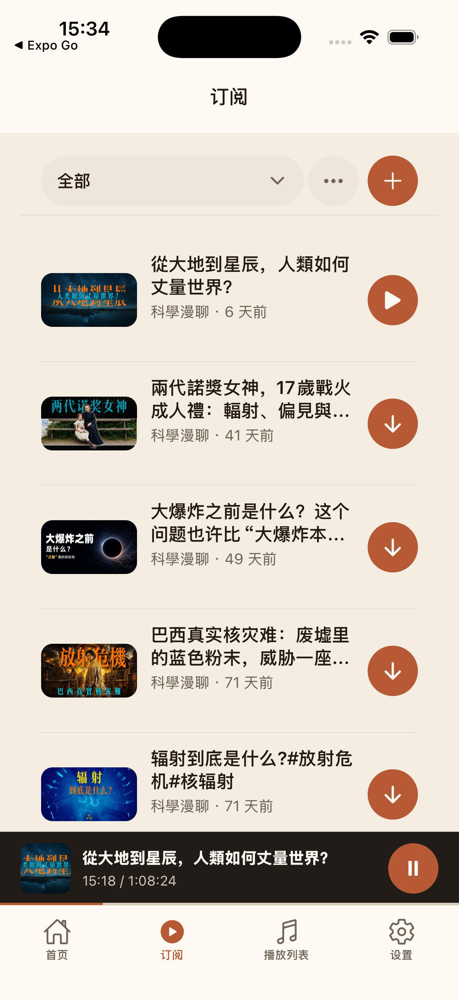
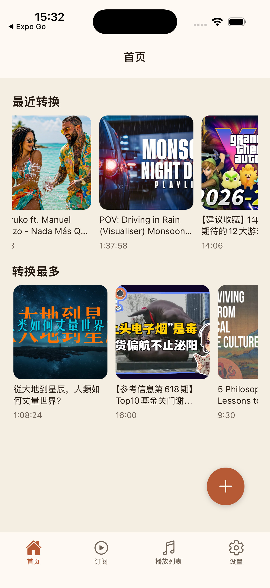
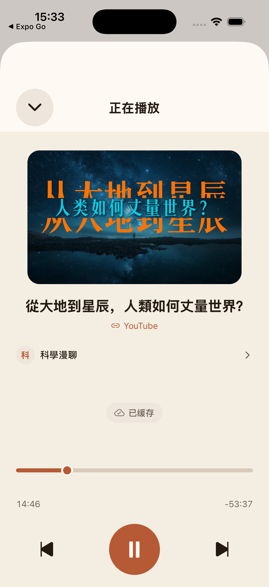
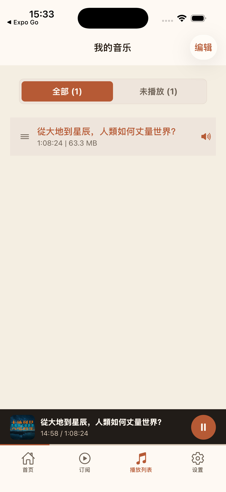
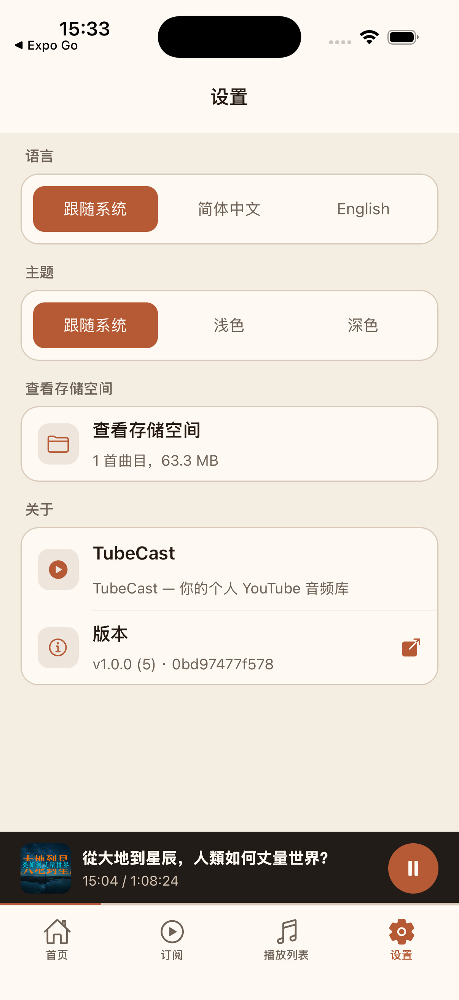

# TubeCast

TubeCast turns YouTube channels into a personal, audio-first listening library. Follow channels, browse new uploads as episodes, save audio for offline listening, and organize it into playlists.

TubeCast is an independent Expo / React Native client for iOS and Android. It is not affiliated with YouTube.

## Screenshots

| Feed | Home | Convert |
| --- | --- | --- |
|  |  |  |
| Player | Playlist | Settings |
|  |  |  |

## Features

- Convert YouTube videos into audio from a pasted URL, with clear queued, downloading, transcoding, saving, playable, failed, and expired states.
- Browse recent and popular converted videos on the Home screen, then play or cache them without leaving the app.
- Follow YouTube channels by URL or handle, manage subscriptions, and browse new uploads in a podcast-style feed.
- Open publisher previews from subscribed feeds or the player, see recent videos, subscribe or unsubscribe, and convert playable episodes.
- Cache completed audio locally for offline playback, retry failed cache jobs, and inspect local storage usage.
- Play audio with a full-screen player, draggable progress bar, previous/next controls, source links, publisher metadata, and cache status.
- Keep listening in the background with iOS lock-screen metadata and a persistent mini player above the tab bar.
- Maintain a local playlist/library with playback progress, listened state, reorder support, swipe-to-delete, bulk edit/delete, and an unplayed-only filter.
- Use light, dark, or system appearance, and switch between English, Simplified Chinese, or system language.

## Try the beta

TubeCast is available via TestFlight for iOS:

**[Join the TestFlight beta](https://testflight.apple.com/join/Pze9SjbP)**

Android is not distributed publicly at this time. See [Local builds](#local-builds) to build from source.

## Installation

### Requirements

- Node.js 20 or later
- pnpm 10
- Expo Go for quick development runs, or Android Studio / Xcode for native builds

### Run in development

```bash
pnpm install
pnpm start
```

Open the Expo development server in Expo Go, or start a native development build:

```bash
pnpm android
pnpm ios
```

## Local builds

TubeCast builds locally; it does not require EAS.

### iOS

Install Xcode, connect an unlocked iPhone, and select a signing team in the generated Xcode project. Then build and install a Release build locally:

```bash
pnpm release:ios
```

This runs `expo run:ios --device --configuration Release`. To create an archive for TestFlight or App Store Connect, use Xcode's **Product → Archive** and Organizer.

### Android

```bash
npx expo prebuild --platform android
cd android
./gradlew assembleRelease
```

The release APK is written to `android/app/build/outputs/apk/release/`.

If you distribute a fork, replace `expo.ios.bundleIdentifier` and `expo.android.package` in `app.json` with identifiers you own. Do not publish a fork under TubeCast's identifiers.

## Releases

Releases are cut locally — no CI builds the binary. The flow:

1. `pnpm release:version` — bumps the marketing version + `ios.buildNumber`, updates `CHANGELOG.md`, tags `vX`, pushes the tag, and opens a **draft** GitHub Release.
2. `pnpm release:archive` → Archive in Xcode (`Product → Archive`) → upload to App Store Connect via Transporter → wait for processing → add the build to the TestFlight group by hand.
3. `pnpm release:publish` — flips the GitHub Release from draft to published and bumps the root repo's submodule pointer.

For same-version TestFlight rebuilds, run `pnpm release:rebuild` and then `pnpm release:testflight`. This bumps only `ios.buildNumber`, tags `testflight/<version>-<build>`, and creates a GitHub prerelease with generated release notes for that build.

Versioning follows [conventional commits](https://www.conventionalcommits.org/) via `commit-and-tag-version` (`feat:` → minor, `fix:` → patch, `BREAKING CHANGE` → major). TestFlight "What's New" is bilingual: English from `CHANGELOG.md`, Chinese written by hand. The first release bootstraps a baseline `v1.0.0` tag from existing history; see `plans/007-mobile-release-flow.md` for the full design.

## Development

```bash
pnpm test
```

The app is deliberately separated from the backend implementation. It communicates only through the HTTP API for job submission and status, channel feeds, library records, and downloadable audio. Keep changes compatible with the existing API contract, or make the server endpoint configurable when adding new capabilities.

## License

TubeCast is licensed under the GNU Affero General Public License v3.0 or later. See [LICENSE](LICENSE).
