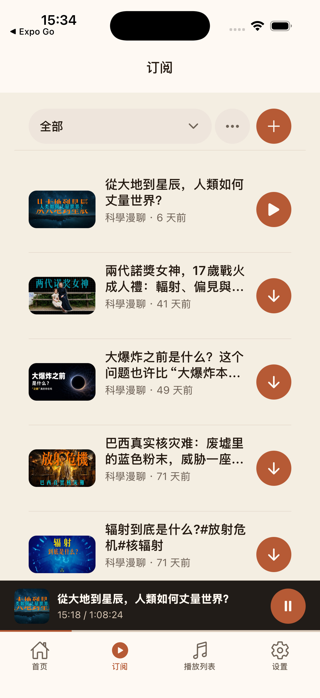
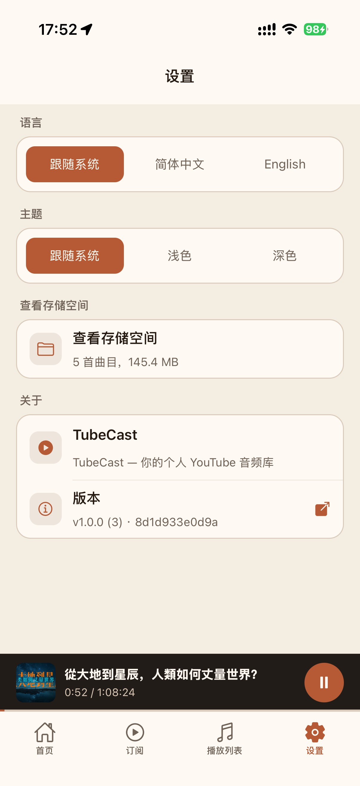
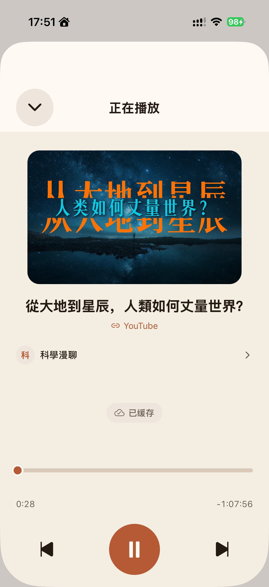
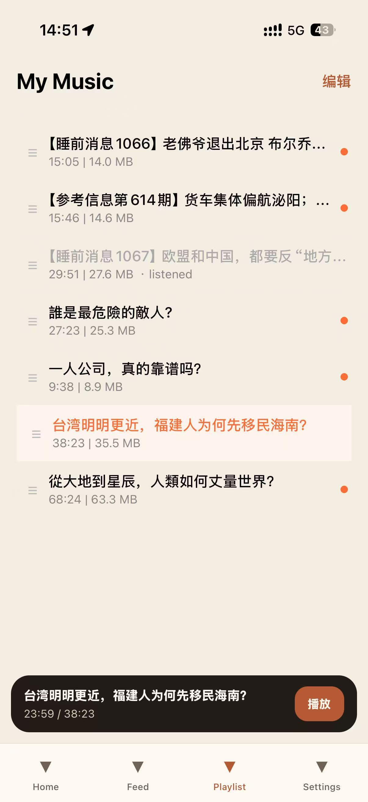
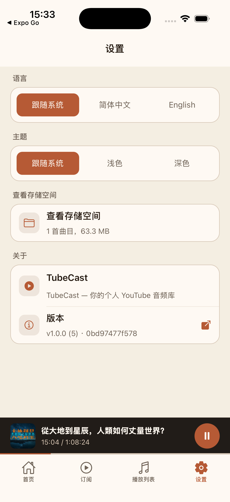

# TubeCast

TubeCast turns YouTube channels into a personal, audio-first listening library. Follow channels, browse new uploads as episodes, save audio for offline listening, and organize it into playlists.

TubeCast is an independent Expo / React Native client for iOS and Android. It is not affiliated with YouTube.

## Screenshots

| Feed | Home | Convert |
| --- | --- | --- |
|  |  |  |
| Player | Playlist | Settings |
|  |  |  |

## Features

- Convert YouTube videos into audio from a pasted URL, with clear queued, downloading, transcoding, saving, playable, failed, and expired states.
- Browse recent and popular converted videos on the Home screen, then play or cache them without leaving the app.
- Follow YouTube channels by URL or handle, manage subscriptions, and browse new uploads in a podcast-style feed.
- Open publisher previews from subscribed feeds or the player, see recent videos, subscribe or unsubscribe, and convert playable episodes.
- Cache completed audio locally for offline playback, retry failed cache jobs, and inspect local storage usage.
- Play audio with a full-screen player, draggable progress bar, previous/next controls, source links, publisher metadata, and cache status.
- Keep listening in the background with iOS lock-screen metadata and a persistent mini player above the tab bar.
- Maintain a local playlist/library with playback progress, listened state, reorder support, swipe-to-delete, bulk edit/delete, and an unplayed-only filter.
- Use light, dark, or system appearance, and switch between English, Simplified Chinese, or system language.

## Try the beta

TubeCast is available via TestFlight for iOS:

**[Join the TestFlight beta](https://testflight.apple.com/join/Pze9SjbP)**

Android is not distributed publicly at this time. See [Local builds](#local-builds) to build from source.

## Installation

### Requirements

- Node.js 20 or later
- pnpm 10
- Expo Go for quick development runs, or Android Studio / Xcode for native builds

### Run in development

```bash
pnpm install
pnpm start
```

Open the Expo development server in Expo Go, or start a native development build:

```bash
pnpm android
pnpm ios
```

### Screenshot demo mode

Use screenshot demo mode when preparing App Store screenshots. It keeps the real
UI but replaces network/storage data with fixed, English demo content and local
illustration covers:

```bash
pnpm start:screenshots
pnpm ios:screenshots
pnpm ios:screenshots:release
pnpm ios:screenshots:ipad
```

The mode is enabled only when `EXPO_PUBLIC_SCREENSHOT_DEMO_MODE=1` is present.
Normal development, TestFlight, and App Store builds keep using real user data.
Use `ios:screenshots:release` for 6.5-inch App Store screenshots. It targets
the `iPhone 13 Pro Max` simulator and avoids development-only overlays such as
the floating Tools button.
Use `ios:screenshots:ipad` for the 13-inch iPad App Store screenshots. It
targets the `iPad Pro 13-inch (M5)` simulator.

## Local builds

TubeCast builds locally; it does not require EAS.

### iOS

Install Xcode, connect an unlocked iPhone, and select a signing team in the generated Xcode project. Then build and install a Release build locally:

```bash
pnpm release:ios
```

This runs `expo run:ios --device --configuration Release`. To create an archive for TestFlight or App Store Connect, use Xcode's **Product → Archive** and Organizer.

### Android

```bash
npx expo prebuild --platform android
cd android
./gradlew assembleRelease
```

The release APK is written to `android/app/build/outputs/apk/release/`.

If you distribute a fork, replace `expo.ios.bundleIdentifier` and `expo.android.package` in `app.json` with identifiers you own. Do not publish a fork under TubeCast's identifiers.

## Releases

Releasing to TestFlight is CI-driven. The only manual step is cutting the version locally; everything from building the IPA to distributing it to testers happens in GitHub Actions.

1. `pnpm release:version` — bumps the marketing version + `ios.buildNumber`, updates `CHANGELOG.md`, tags `vX.Y.Z`, pushes the tag, and opens a **draft** GitHub Release.
2. Pushing the `vX.Y.Z` tag triggers `.github/workflows/release-testflight.yml`, which: builds the IPA with EAS Build (cloud macOS, EAS-managed signing), uploads it to TestFlight via fastlane, generates bilingual (EN/中文) "What to Test" notes with an LLM call, distributes the build to the `Public Beta Testers` group, tags `testflight/<version>-<build>` with a prerelease GitHub changelog, and flips the draft Release to published — no manual clicks.
3. The private root repo's `mobile` submodule pointer is intentionally **not** bumped by CI (the two repos stay independent; no cross-repo write token is granted). Run `pnpm release:publish` locally whenever you want to sync it, same as before.

For a same-version hotfix rebuild (buildNumber bump only, no new marketing version/tag), push a plain commit and trigger the workflow manually:

```bash
pnpm release:testflight-bump   # buildNumber+1, commit + push (no tag)
```

Then run the `Release to TestFlight` workflow via `workflow_dispatch` (GitHub UI or `gh workflow run release-testflight.yml`). The hotfix path runs the same build/upload/distribute/tag steps but skips promoting a Release (that only applies to an actual version-tag release).

Versioning follows [conventional commits](https://www.conventionalcommits.org/) via `commit-and-tag-version` (`feat:` → minor, `fix:` → patch, `BREAKING CHANGE` → major). The first release bootstraps a baseline `v1.0.0` tag from existing history. See `plans/007-mobile-release-flow.md` for the original local-only design and `plans/009-mobile-eas-ci-release.md` for the CI/EAS automation that superseded its build/upload/distribution steps.

### One-time CI setup

Before the workflow can run, someone with the right account access needs to do this once:

- `eas login` / `eas init` (writes `expo.extra.eas.projectId` into `app.json`) and `eas credentials` for iOS, so EAS manages the Apple signing certificate/provisioning profile itself — no `fastlane match` needed. Done — see `expo.extra.eas.build.experimental.ios.appExtensions` in `app.json`, which is required for `eas credentials` to also provision the `TubeCastShareExtension` target (EAS doesn't discover hand-added extension targets on its own).
- Mint an Expo robot/service-account token and store it as the `EXPO_TOKEN` GitHub Actions secret.
- Store the existing App Store Connect API key as `APP_STORE_CONNECT_API_KEY_KEY_ID`, `APP_STORE_CONNECT_API_KEY_ISSUER_ID`, and the `.p8` file's contents as `APP_STORE_CONNECT_API_KEY_P8`.
- `ANTHROPIC_API_KEY` is reused from the existing OpenWiki workflow secret.
- `eas build --platform ios --profile production` has been dry-run by hand and produces an installable IPA. Getting there required: adding a standalone `mobile/pnpm-lock.yaml` (this repo never had its own — the lockfile only ever existed in the private monorepo's workspace), pinning `react-native-reanimated` to the exact version already in use (an unpinned range resolved to a newer, incompatible `react-native-worklets` requirement without lockfile history), adding `@expo/config-plugins` as an explicit devDependency (`withShareExtension.cjs` needs it directly, previously only available via workspace hoisting), and fixing `withShareExtension.cjs` to hardcode the Apple Team ID on the extension target instead of reading it back from the main target (EAS's own `expo prebuild` never runs `release.mjs`'s `syncNativeIosVersion()`, so neither target had it yet at plugin-run time).

The local `fastlane testflight_build`/`release:archive` (Xcode Archive) path still works as a manual fallback if EAS is ever unavailable.

### App Store metadata automation

App Store Connect metadata, screenshots, and TestFlight helper lanes are managed
with fastlane. The local Xcode Archive / Transporter flow remains available as a
fallback.

First-time setup:

```bash
cd mobile
mise install
mise exec -- bundle install
```

Download the current App Store Connect metadata before making broad edits:

```bash
pnpm store:download-metadata
pnpm store:download-screenshots
```

Edit files under `fastlane/metadata/<locale>/`, then upload metadata only:

```bash
pnpm store:metadata
```

Upload screenshots only:

```bash
pnpm store:screenshots
```

Upload both metadata and screenshots:

```bash
pnpm store:assets
```

The configured locales are Simplified Chinese (`zh-Hans`), English (`en-US`),
and Traditional Chinese (`zh-Hant`). Add more locales only when you intend to
maintain their keywords, description, and screenshots.

## Development

```bash
pnpm test
```

The app is deliberately separated from the backend implementation. It communicates only through the HTTP API for job submission and status, channel feeds, library records, and downloadable audio. Keep changes compatible with the existing API contract, or make the server endpoint configurable when adding new capabilities.

## License

TubeCast is licensed under the GNU Affero General Public License v3.0 or later. See [LICENSE](LICENSE).
