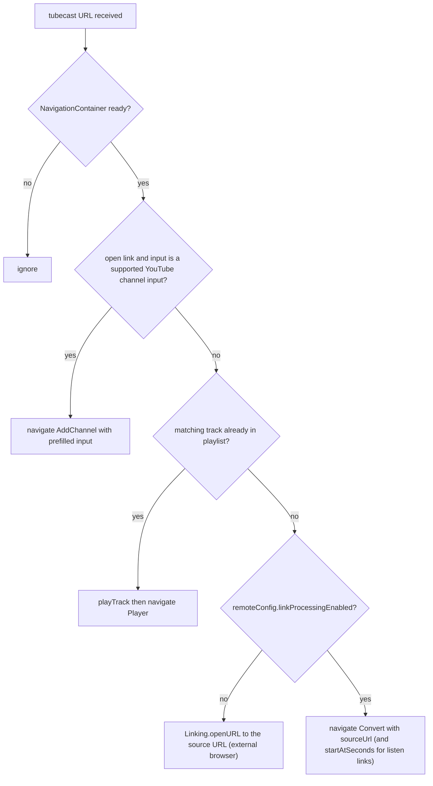

# Architecture Overview

TubeCast is an Expo / React Native app (Expo SDK 56, React Native 0.85, React 19) that converts YouTube videos into listenable audio tracks. The app shell is intentionally tiny: `index.ts` registers the root component (and enables screen freezing via `react-native-screens` to save CPU on hidden tabs), `App.tsx` composes just two pieces — `AppProviders` wrapping `RootNavigator` — and everything else lives under `src/`.

## Directory Layout

```
src/
├── app/                    # App-level configuration
│   ├── navigation/         # RootNavigator + param list types
│   ├── providers/          # AppProviders (single provider stack)
│   ├── theme.tsx           # Theme tokens, light/dark palettes, AppThemeProvider
│   └── theme-preference.ts # Theme preference resolution ("system" default)
├── components/             # Shared UI components (MiniPlayer, DiscoverCard, ...)
├── features/               # Feature modules (player, playlist, jobs, youtubeFeed,
│                           # remoteConfig, settings, shareLinks, discover, ...)
├── screens/                # One screen component per route
├── i18n/                   # Translations and I18nProvider
└── shared/                 # Utilities (apiClient, errors, imageSource)
```

The split is feature-based: each `src/features/<name>/` module owns its own context, storage, and hooks (e.g. `features/player/context.tsx`, `features/playlist/storage.ts`). Screens are thin route targets; state and persistence live in features.

## Provider Stack

`AppProviders` (`src/app/providers/AppProviders.tsx`) defines the single, ordered provider stack mounted once in `App.tsx`:

```text
GestureHandlerRootView
└── SafeAreaProvider
    └── QueryClientProvider          (React Query, queries retry: 1)
        └── AppThemeProvider         (colors, isDark; persists "settings_theme")
            └── I18nProvider         (locale; persists language key)
                └── RemoteConfigProvider  (feature flags fetched at mount)
                    └── SettingsProvider
                        └── PlaylistProvider
                            └── PlayerProvider   (innermost; uses playlist)
```

Composition rules that matter:

- **Ordering is semantic.** `PlayerProvider` is innermost because playback depends on playlist state; `RemoteConfigProvider` sits above `SettingsProvider` and the rest so feature flags are readable app-wide; theme and i18n must precede any consumer that renders localized/themed UI at mount.
- **React Query client** is created once via `useState` with `defaultOptions.queries.retry = 1` — deliberately low because the shared API client has a 15s timeout and the default 3 retries would keep spinners up ~45s+ on hung requests.
- **Remote config** (`features/remoteConfig/context.tsx`) starts from hardcoded defaults (`linkProcessingEnabled: true`, `audioExportEnabled: true`), then on mount tries `EXPO_PUBLIC_MOBILE_CONFIG_URL` and falls back to `${SERVER_URL}/api/mobile-config`, cache-busting each fetch; if every fetch fails the defaults remain in effect for the whole session.
- **Theme** (`src/app/theme.tsx`) exposes `{ colors, isDark, preference, setTheme }`. The preference defaults optimistically to `"system"` (avoids a startup white flash), is corrected after an AsyncStorage read of key `settings_theme`, and `isDark` tracks `useColorScheme()` live while in system mode. Static design tokens (`typography`, `spacing`, `radii`) are exported as plain constants, not context values.

## Navigation Structure

`RootNavigator` (`src/app/navigation/RootNavigator.tsx`) builds a native stack whose first screen is a bottom-tab navigator; each tab wraps its screen in a one-screen native stack (giving every tab its own stack root for future depth):

```text
RootStackNavigator (native stack)
├── Tabs (bottom tabs, header hidden)
│   ├── Home      → HomeStack.HomeRoot       → HomeScreen
│   ├── Feed      → FeedStack.FeedRoot       → FeedScreen
│   ├── Playlist  → PlaylistStack.PlaylistRoot → PlaylistScreen
│   └── Settings  → SettingsStack.SettingsRoot → SettingsScreen
│   └── MiniPlayer rendered above the tab bar (inside Tabs)
├── Player            modal, slide_from_bottom, no header
├── AddChannel        formSheet
├── ManageChannels    modal
├── Convert           formSheet
└── PublisherPreview  formSheet
```

Route param types live in `src/app/navigation/types.ts` (`RootStackParamList`, `RootTabParamList`). The `NavigationContainer` theme is derived from the app theme colors each render, and `onReady` flips a `navigationReady` flag that gates deep-link processing. `MiniPlayer` is not a route — it is rendered by `Tabs` with the computed tab-bar height and navigates to `Player` on tap.

## Deep Linking (tubecast://)

The app registers the `tubecast` URL scheme (`app.json`). Deep links are handled imperatively in `RootNavigator` — there is no linking config; `handleDeepLink` parses the URL and navigates via the navigation ref once the container is ready. On mount (after `onReady`) it processes `Linking.getInitialURL()` exactly once (guarded by a ref), then subscribes to `url` events for runtime links (e.g. from the iOS share extension).

Two link formats are parsed by `features/shareLinks/links.ts`:

- `tubecast://listen?url=<sourceUrl>&t=<seconds>` — a "moment" with a start timestamp
- `tubecast://open?url=<sourceUrl>` — a plain open/share link

Resolution order (verified from source):



*Deep-link resolution order in `RootNavigator.handleDeepLink`; listen links additionally pass `startAtSeconds` to both playback and the Convert screen.*

Note the fallback invariant: when server-side link processing is disabled by remote config and no local track matches, the app refuses to convert and instead hands the URL to the OS browser.

## Data Layer

### React Query

Server data (YouTube feeds, channel queries, discover content, conversion job polling) flows through `@tanstack/react-query` v5 hooks in each feature's `hooks.ts` (e.g. `features/youtubeFeed/hooks.ts`, `features/jobs/hooks.ts`). React Query provides background refetching, request deduplication, and cache management; feature modules add AsyncStorage-backed persistence layers beneath the query cache so feeds/discover content survive cold starts (e.g. `youtubeFeed/cache.ts`, `discover/cache.ts` with a 24h freshness window).

### Core model

`src/types.ts` defines `Job` — the central conversion entity — with `status: "queued" | "processing" | "ready" | "failed"`, a parallel `summaryStatus` for AI summaries, audio location fields (`audioPath` / `audioHref` / `audioUrl` / `audioExpiresAt`), and an `idempotencyKey` for safe resubmission.

## Persistence Model

AsyncStorage is the sole on-device key/value store; each feature owns namespaced keys:

| Data | Owner | Notes |
|---|---|---|
| Theme preference (`settings_theme`) | `app/theme.tsx` | `"system" \| "light" \| "dark"` |
| Language | `i18n/index.tsx` | optimistic default, corrected after read |
| Tracks & playlists | `features/playlist/storage.ts` | source of `getAllTracks()` used by deep links |
| Channels | `features/youtubeFeed/storage.ts` | subscriptions |
| Feed / discover caches | `features/*/cache.ts` | time-windowed cold-start restore |
| Playback progress (`progress:<trackId>`) | `features/player/context.tsx` | written during playback, removed on completion |
| Pending job id | `ConvertScreen` | survives a kill mid-conversion |

`expo-secure-store` is available for secrets; conversion jobs themselves are created server-side and polled via React Query.

## Native Configuration Highlights

From `app.json`: background audio playback is enabled via the `expo-audio` plugin; Android declares media-playback foreground-service permissions; an iOS share extension (`TubeCastShareExtension`, app group `group.com.tomyail.tubecast`) is wired through `plugins/withShareExtension.cjs` and delivers YouTube URLs into the app via the `tubecast://` scheme.

## Related Pages

- [/openwiki/development/conventions.md](/openwiki/development/conventions.md)
- [/openwiki/features/conversion-pipeline.md](/openwiki/features/conversion-pipeline.md)
- [/openwiki/features/overview.md](/openwiki/features/overview.md)
- [/openwiki/features/playback-library.md](/openwiki/features/playback-library.md)
