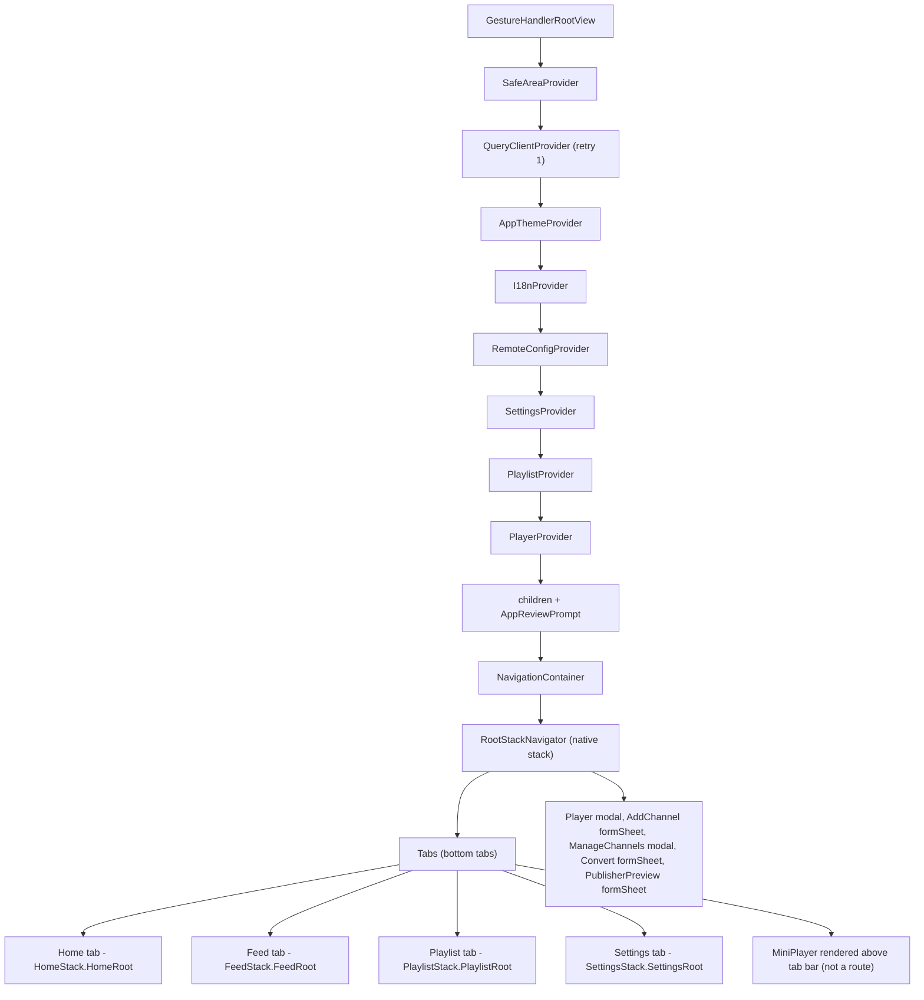
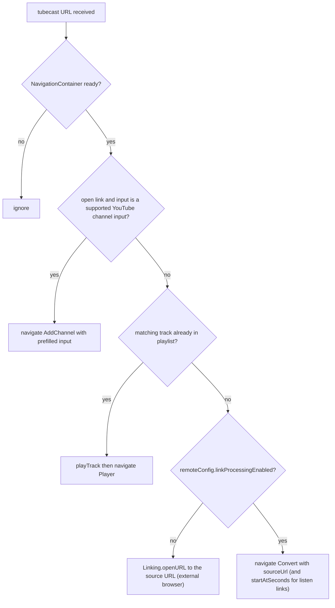

# Architecture Overview

TubeCast is an Expo / React Native app (Expo SDK 56, React Native 0.85, React 19) that converts YouTube videos into listenable audio tracks. The app shell is intentionally tiny: `index.ts` registers the root component (and enables screen freezing via `react-native-screens` to save CPU on hidden tabs), `App.tsx` composes just two pieces — `AppProviders` wrapping `RootNavigator` — and everything else lives under `src/`.

## Directory Layout

```
src/
├── app/                    # App-level configuration
│   ├── navigation/         # RootNavigator + param list types
│   ├── providers/          # AppProviders (single provider stack)
│   ├── theme.tsx           # Theme tokens, light/dark palettes, AppThemeProvider
│   └── theme-preference.ts # Theme preference resolution ("system" default)
├── components/             # Shared UI components (MiniPlayer, DiscoverCard, ...)
├── features/               # Feature modules (player, playlist, jobs, youtubeFeed,
│                           # remoteConfig, settings, shareLinks, discover, ...)
├── screens/                # One screen component per route
├── i18n/                   # Translations and I18nProvider
└── shared/                 # Utilities (apiClient, errors, imageSource)
```

The split is feature-based: each `src/features/<name>/` module owns its own context, storage, and hooks (e.g. `features/player/context.tsx`, `features/playlist/storage.ts`). Screens are thin route targets; state and persistence live in features.

## Provider Stack and Navigation Tree

`AppProviders` (`src/app/providers/AppProviders.tsx`) defines the single, ordered provider stack mounted once in `App.tsx`; `RootNavigator` renders the navigation tree beneath it:



*The full mount tree: ordered providers in `AppProviders`, then the root native stack, tab navigator, and root-level modal/sheet screens in `RootNavigator`.*

Composition rules that matter:

- **Ordering is semantic.** `PlayerProvider` is innermost because playback depends on playlist state; `RemoteConfigProvider` sits above `SettingsProvider` and the rest so feature flags are readable app-wide; theme and i18n must precede any consumer that renders localized/themed UI at mount. `AppReviewPrompt` is mounted inside `PlayerProvider` alongside the children so the review prompt logic can observe app usage.
- **React Query client** is created once via `useState` with `defaultOptions.queries.retry = 1` — deliberately low because the shared API client has a 15s timeout and the default 3 retries would keep spinners up ~45s+ on hung requests.
- **Remote config** (`features/remoteConfig/context.tsx`) starts from hardcoded defaults (`linkProcessingEnabled: true`, `audioExportEnabled: true`), then on mount tries `EXPO_PUBLIC_MOBILE_CONFIG_URL` and falls back to `${SERVER_URL}/api/mobile-config`, cache-busting each fetch; if every fetch fails the defaults remain in effect for the whole session.
- **Theme** (`src/app/theme.tsx`) exposes `{ colors, isDark, preference, setTheme }`. The preference defaults optimistically to `"system"` (avoids a startup white flash), is corrected after an AsyncStorage read of key `settings_theme`, and `isDark` tracks `useColorScheme()` live while in system mode. A second effect calls `Appearance.setColorScheme` on every preference change so native hosts (e.g. iOS SwiftUI `UIHostingController` views like Kickstart) follow the app's own light/dark choice — `"system"` passes `null` to restore OS tracking, and the effect is skipped on platforms without the API. Static design tokens (`typography`, `spacing`, `radii`) are exported as plain constants, not context values, because they do not vary with light/dark mode.
- **NavigationContainer theme** is derived from the app theme colors each render, and `onReady` flips a `navigationReady` flag that gates deep-link processing. Route param types live in `src/app/navigation/types.ts` (`RootStackParamList`, `RootTabParamList`).

Each tab wraps its screen in a one-screen native stack, giving every tab its own stack root for future depth. `MiniPlayer` is not a route — it is rendered by `Tabs` with the computed tab-bar height (`TAB_BAR_CONTENT_HEIGHT + insets.bottom`) and navigates to `Player` on tap. Root-level screens: `Player` (modal, `slide_from_bottom`, no header), `AddChannel` / `Convert` / `PublisherPreview` (formSheet), `ManageChannels` (modal); the formSheet/modal screens other than `Player` get a `CloseModalButton` header-left that calls `goBack()`.

## Deep Linking (tubecast://)

The app registers the `tubecast` URL scheme (`app.json`). Deep links are handled imperatively in `RootNavigator` — there is no linking config; `handleDeepLink` parses the URL and navigates via the navigation ref once the container is ready. On mount (after `onReady`) it processes `Linking.getInitialURL()` exactly once (guarded by a ref), then subscribes to `url` events for runtime links (e.g. from the iOS share extension).

Two link formats are parsed by `features/shareLinks/links.ts`:

- `tubecast://listen?url=<sourceUrl>&t=<seconds>` — a "moment" with a start timestamp
- `tubecast://open?url=<sourceUrl>` — a plain open/share link

Resolution order (verified from source):



*Deep-link resolution order in `RootNavigator.handleDeepLink`; listen links additionally pass `startAtSeconds` to both playback and the Convert screen.*

Note the fallback invariant: when server-side link processing is disabled by remote config and no local track matches, the app refuses to convert and instead hands the URL to the OS browser.

## Data Layer

### React Query

Server data (YouTube feeds, channel queries, discover content, conversion job polling) flows through `@tanstack/react-query` v5 hooks in each feature's `hooks.ts` (e.g. `features/youtubeFeed/hooks.ts`, `features/jobs/hooks.ts`). React Query provides background refetching, request deduplication, and cache management; feature modules add AsyncStorage-backed persistence layers beneath the query cache so feeds/discover content survive cold starts (e.g. `youtubeFeed/cache.ts`, `discover/cache.ts`; discover restores data up to 24 hours old on cold start with a 5-minute in-memory cache).

### Core model

`src/types.ts` defines `Job` — the central conversion entity — with `status: "queued" | "processing" | "ready" | "failed"`, a parallel `summaryStatus` for AI summaries, audio location fields (`audioPath` / `audioHref` / `audioUrl` / `audioExpiresAt`), and an `idempotencyKey` for safe resubmission.

## Persistence Model

AsyncStorage is the sole on-device key/value store; each feature owns namespaced keys:

| Data | Owner | Notes |
|---|---|---|
| Theme preference (`settings_theme`) | `app/theme.tsx` | `"system" \| "light" \| "dark"` |
| Language | `i18n/index.tsx` | optimistic default, corrected after read |
| Tracks & playlists | `features/playlist/storage.ts` | source of `getAllTracks()` used by deep links |
| Channels | `features/youtubeFeed/storage.ts` | subscriptions |
| Feed / discover caches | `features/*/cache.ts` | time-windowed cold-start restore |
| Playback progress (`progress:<trackId>`) | `features/player/context.tsx` | written during playback, removed on completion |
| Pending job id | `ConvertScreen` | survives a kill mid-conversion |
| App-review state, submitted jobs | `features/appReview/storage.ts`, `features/youtubeFeed/submittedJobsStorage.ts` | smaller feature-owned keys |

`expo-secure-store` is available for secrets; conversion jobs themselves are created server-side and polled via React Query.

## Native Layer

### app.json

From `app.json`: background audio playback is enabled via the `expo-audio` plugin (`enableBackgroundPlayback: true`); Android declares `RECORD_AUDIO`, `MODIFY_AUDIO_SETTINGS`, `FOREGROUND_SERVICE`, and `FOREGROUND_SERVICE_MEDIA_PLAYBACK` permissions; both iOS and Android use bundle id `com.tomyail.tubecast` with iOS deployment target 18.0 (pinned both directly and via `expo-build-properties`, because the Kickstart Exchange SDK requires it). The EAS `extra` block declares the `TubeCastShareExtension` app extension target (`com.tomyail.tubecast.ShareExtension`) with app group entitlement `group.com.tomyail.tubecast`.

### Share extension config plugin (`plugins/withShareExtension.cjs`)

The `withShareExtension` Expo config plugin turns the checked-in template in `ios-share-extension/` into a real Xcode app-extension target at prebuild time. It does three things:

1. **`withDangerousMod` (ios)** — copies `ios-share-extension/` (`ShareViewController.swift`, `TubeCastShareExtension-Info.plist`) into `ios/TubeCastShareExtension/`; writes matching app-group entitlements plists for both the main app (`ios/TubeCast/TubeCast.entitlements`) and the extension; and patches `AppDelegate.swift` (idempotently, guarded by a `tubeCastAppGroupIdentifier` marker check).
2. **`withXcodeProject`** — creates (or reuses) the `TubeCastShareExtension` `app_extension` target, adds Sources/Frameworks/Resources build phases, registers `ShareViewController.swift` in the group, and copies build settings from the main target (version, device family) with `DEVELOPMENT_TEAM` falling back to a hardcoded `G8JC6TALT6` because EAS prebuild runs before release scripts can sync the team — otherwise headless builds fail signing.
3. **Target hardening** — sets `APPLICATION_EXTENSION_API_ONLY = YES`, `IPHONEOS_DEPLOYMENT_TARGET = 18.0` (extension must not be below host app or App Store validation rejects it), `SKIP_INSTALL`, Swift 5.0, and the app-extension run-path search paths.

The AppDelegate patch is the share-extension handoff: the extension writes the shared URL into the app group `UserDefaults` under key `TubeCastPendingOpenUrl`; on launch `application(_:didFinishLaunchingWithOptions:)` consumes it and injects it into `launchOptions` as the launch URL, `applicationDidBecomeActive` re-checks after a 0.5s delay (in case the app was already running warm), and the direct `open url` responder path consumes any pending URL first to avoid double delivery. The URL then flows into React Native as a normal `tubecast://` linking event handled by `RootNavigator`.

## Related Pages

- [/openwiki/development/conventions.md](/openwiki/development/conventions.md)
- [/openwiki/features/overview.md](/openwiki/features/overview.md)
- [/openwiki/features/playback-library.md](/openwiki/features/playback-library.md)
- [/openwiki/quickstart.md](/openwiki/quickstart.md)
