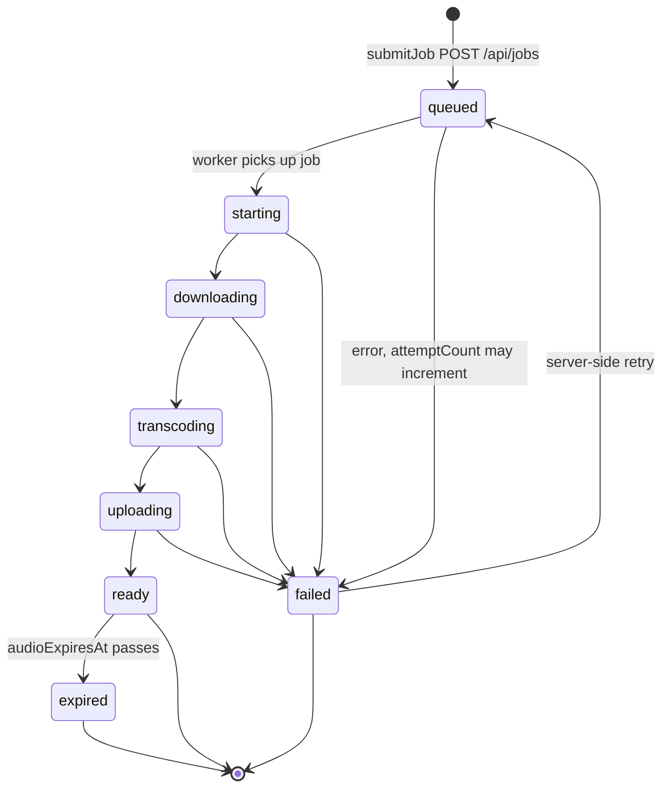
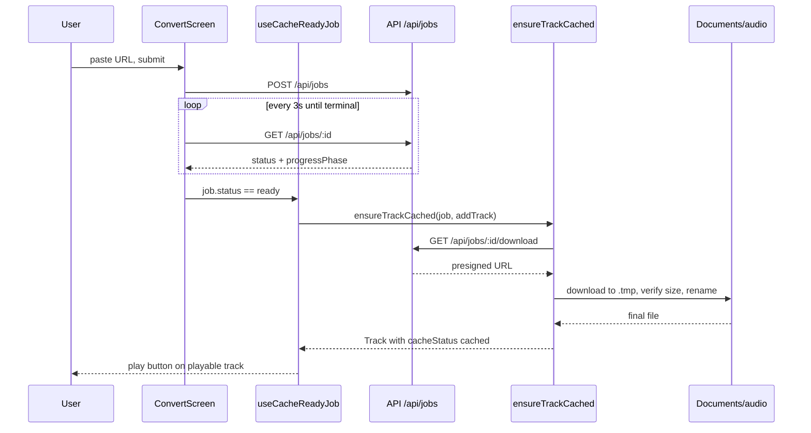

# Conversion Pipeline

The conversion pipeline turns a YouTube URL into a playable, locally cached audio track. It spans URL intake (manual paste or TubeCast deep link), a server-side job that downloads/transcodes/uploads the audio, client-side polling of that job, automatic download of the finished audio into app storage, creation of a library `Track`, and optional export/share of the cached file. Two remote-config flags — `linkProcessingEnabled` and `audioExportEnabled` — act as server-controlled kill switches for intake and export respectively.

## URL intake

Two entrypoints feed the pipeline:

- **Manual paste** — `ConvertScreen` (`src/screens/ConvertScreen.tsx`) shows a URL field with a clipboard paste button. Submitting calls `useSubmitJob`, which POSTs `{ sourceUrl }` to `/api/jobs` via `submitJob` in `src/features/jobs/api.ts` and stores the returned job id in AsyncStorage under `pending_job_id` so an interrupted conversion resumes on next mount.
- **Deep links** — `RootNavigator.handleDeepLink` (`src/app/navigation/RootNavigator.tsx`) handles `tubecast://open?url=...` and `tubecast://listen?url=...&t=...` (parsed by `parseTubeCastOpenUrl` / `parseTubeCastListenUrl` in `src/features/shareLinks/links.ts`). If a track for that source URL already exists (matched by YouTube video id or exact URL via `findTrackForSourceUrl` in `src/features/shareLinks/matching.ts`), it plays immediately; otherwise the navigator routes to `Convert` with `sourceUrl` (and `startAtSeconds` for listen links, which auto-plays once ready). Channel URLs are redirected to `AddChannel` instead.

The same screens are reused from `FeedScreen` and `PublisherPreviewSheet` via the `useSubmitJob` hook, so feed items convert through the identical job flow.

## Remote config gating

`RemoteConfigProvider` (`src/features/remoteConfig/context.tsx`) fetches `/api/mobile-config` (from `EXPO_PUBLIC_MOBILE_CONFIG_URL`, falling back to the server URL) with cache-busting headers, and parses a `features` object into two booleans that both default to `true`:

- `linkProcessingEnabled` — when false, `ConvertScreen` disables the submit button and shows "feature unavailable"; `HomeScreen`, `FeedScreen`, and `AddChannelScreen` hide conversion entrypoints; and deep links to un-cached sources are handed off to the OS via `Linking.openURL` instead of starting a conversion.
- `audioExportEnabled` — when false, `PlayerScreen` and `PlaylistScreen` hide the export/actions UI, leaving only the share-moment action.

## Server job lifecycle

`POST /api/jobs` returns `{ id, status, sourceUrl }`; everything else arrives via polling `GET /api/jobs/:id`, which returns the full `JobResponse` (`src/features/jobs/api.ts`): metadata (title, duration, thumbnail, channel), audio facts (`audioFormat`, `contentType`, `audioFileSize`, `audioExpiresAt`), attempt tracking (`attemptCount`, `errorMessage`, `lastErrorMessage`), and progress fields (`progressPhase`, `progressUpdatedAt`).

Job `status` is one of `queued | processing | ready | failed | expired`. The finer-grained `progressPhase` is `queued | starting | downloading | transcoding | uploading | ready`. `GET /api/jobs/:id/download` returns a presigned URL for the finished audio.

Server-side job lifecycle as seen by the client: `status` (queued/processing/ready/failed/expired) is the source of truth; `progressPhase` refines the `processing` window.

### Polling

`useJobStatus(jobId)` is a React Query with key `["job", jobId]`, refetching every 3 seconds. Polling stops (`refetchInterval` returns `false`) once the status is terminal — `ready`, `failed`, or `expired`. Requests go through the shared axios `apiClient` (`src/shared/apiClient.ts`): 15 s timeout, and response interceptors map HTTP 410 → `AudioExpiredError`, 429 → `RateLimitError` (with parsed `Retry-After`), other non-2xx → `ApiError`, and network/timeout failures → plain `Error`.

### Progress display

`normalizeProgressPhase` (`src/features/jobs/progress.ts`) prefers the server's `progressPhase` when it is a known value, maps any unknown non-empty phase to `starting`, and otherwise derives a phase from `status`. `getHomeProgressInfo` merges job phase with the local cache state into a five-step UI (`PROGRESS_STEPS = queued, download, transcode, save, playable`) plus localized title/detail. When `attemptCount > 0` and `lastErrorMessage` is set, a queued job displays as "retrying" rather than "queued". Cache states (`caching`/`cached`/`error`) override the job phase display and pin the step at "playable".

### Failure and expiry

- **Failed** — `getConversionFailureMessage` (`src/features/jobs/errors.ts`) returns a localized "live unsupported" message when the error text matches live/premiere/upcoming patterns (including Chinese `直播`), otherwise the raw `errorMessage`/`lastErrorMessage`. `ConvertScreen` also shows which phase the job failed at.
- **Expired** — jobs whose server-side audio retention has lapsed report `status: "expired"`; `ConvertScreen` shows an "expired" card. Terminal statuses also clear the `pending_job_id` AsyncStorage key. At playback time, a 410 surfaces as `AudioExpiredError` via the apiClient interceptor.
- **Submission errors** — a failed POST (e.g. `RateLimitError`) shows a generic alert and leaves no pending job.

## From ready job to playable track

When a job becomes `ready`:

1. `useCacheReadyJob` (`src/features/jobs/hooks.ts`) immediately adds a `Track` built by `trackFromReadyJob` (`src/features/jobs/track.ts`) to the playlist, then kicks off caching. `playableTrackFromReadyJob` deduplicates against existing tracks by `jobId`, then by YouTube video id (parsed from `sourceUrl`, preferring `job.sourceId`), so a re-submitted video reuses the existing track instead of duplicating it.
2. `ensureTrackCached` (`src/features/jobs/cache.ts`) downloads the audio via the presigned download URL into `Documents/audio/<jobId>.<ext>.tmp`, verifies the byte size against `job.audioFileSize`, then atomically renames to the final file (extension from `job.audioFormat`, default `m4a`). Concurrency is guarded by an in-flight promise map keyed by job id, and an already-present final file short-circuits to a cached track. On any error the temp file is deleted and the failure propagates.
3. The cached track (with `localPath`, `localFilename`, `downloadedAt`, `cacheStatus: "cached"`) is written back through `addTrack`. If caching fails while the job is ready, the track is saved with `cacheStatus: "failed"` plus `cacheError` — the audio remains playable via streaming, and `retryCache` re-runs the download.

Client-side flow from URL submission through polling to a locally cached, playable track.

## Audio export

`useTrackAudioExport` (`src/features/audioExport/hooks.ts`) exports a track to the OS share sheet. If the track is not yet cached, it re-fetches the job (`getJob`), requires `status: "ready"`, and runs `ensureTrackCached` first — so export works for streaming-only tracks as long as the server still has the audio. `shareTrackAudioFile` (`src/features/audioExport/exportFile.ts`) checks `Sharing.isAvailableAsync` (throwing `AudioExportUnavailableError` otherwise), copies the local file into `Cache/exports/` under a sanitized filename, and shares it as `audio/mp4` with UTI `public.mpeg-4-audio`. Filenames are built by `buildAudioExportFilename` (`src/features/audioExport/filename.ts`): reserved/control characters are replaced with spaces and the `title-channel` basename is truncated to 120 characters, falling back to `TubeCast-<jobId>.m4a`. Failures show a localized alert; a single `exportingTrackId` guard prevents concurrent exports.

## Tests

Focused unit tests cover the pipeline's pure logic: `test/jobs/cache.test.ts` (download, size verification, dedup/in-flight reuse, temp cleanup), `test/jobs/progress.test.ts` (phase normalization, retry display, cache-state overrides), `test/jobs/errors.test.ts` (live-unsupported pattern matching, failure messages), `test/jobs/track.test.ts` (track construction and job/video-id dedup), and `test/audioExport/filename.test.ts` (filename sanitization/truncation).

## Relationships

- Playback and library behavior of the resulting tracks is covered in [Playback & Library](/openwiki/features/playback-library.md).
- Feed-originated conversions (expired feed items falling back to `ConvertScreen`) are covered in [Subscriptions Feed](/openwiki/features/subscriptions-feed.md).
- Overall system layout is covered in [Architecture Overview](/openwiki/architecture/overview.md).
