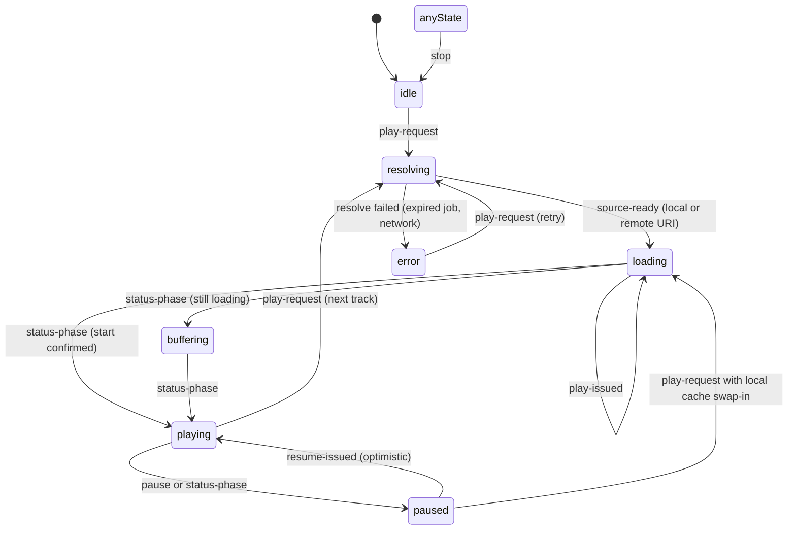
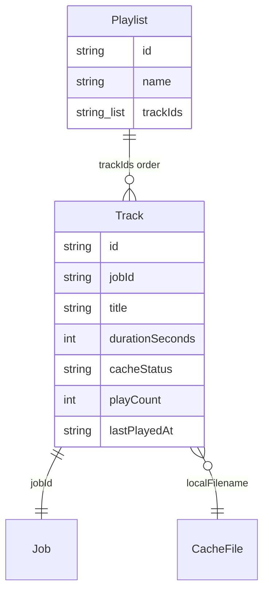

# Playback & Library

The playback and library system spans two feature modules — `src/features/player/` (playback engine) and `src/features/playlist/` (persisted track library) — plus the UI layer (`PlayerScreen`, `PlaylistScreen`, `MiniPlayer`). Providers are mounted once near the app root (`src/app/providers/AppProviders.tsx`), so both contexts are app-global.

## Player state machine

`PlayerProvider` (`src/features/player/context.tsx`) wraps a single `expo-audio` `useAudioPlayer` instance behind a `useReducer` state machine defined in `src/features/player/state.ts`. The phase is one of `idle | resolving | loading | buffering | playing | paused | error`.

The reducer phases and the guards that move between them. `play-request` → `resolving`, `source-ready` → `loading`, and `play-issued` confirm the audio source is attached and playback has been commanded.

Key invariants:

- **Stale-response protection.** Every action carries a `requestId`; the reducer ignores `source-ready`, `play-issued`, `resume-issued`, and `error` actions whose id does not match the current one, and the async `playTrack` flow re-checks `requestId !== requestIdRef.current` after each `await`. Rapidly tapping tracks cannot apply results of a superseded request.
- **Only phase changes dispatch.** The status→phase effect (`phaseFromAudioStatus`) only dispatches `status-phase` when the computed phase differs from the current one, so a stale closure cannot flip `paused` back to `playing` after the user paused.
- **Optimistic resume with grace period.** `resume-issued` immediately sets `playing` (skipping a loading flash); if `player.play()` has not taken effect yet the status may briefly report not-playing, so transitions `playing → paused` within 800 ms of a resume (`RESUME_GRACE_MS`) are suppressed to avoid button flicker.
- **Start confirmation.** `isPlaybackStartConfirmed` requires `currentTime` to be within `[startPosition + 0.25, startPosition + 5]` before the status effect promotes `loading`/`buffering` to `playing`, distinguishing real progress from stale status snapshots.
- **Completion edge-trigger.** `didJustFinish` is tracked with a `false→true` edge (`prevFinishedRef`) so auto-advance fires exactly once per track; without it the effect re-runs on `activeTrack` changes and re-triggers `playNext` in a render loop.

Derived context values: `playbackLoading = resolving | loading | buffering`, `isPlaying = phase === "playing"`, `isBuffering = phase === "buffering" || status.isBuffering`.

### Split progress context

High-frequency playback position (~100 ms cadence via the player's 500 ms status interval driving state) is exposed through a separate `PlaybackProgressContext` and the `usePlaybackProgress()` hook, so progress-bar components do not re-render action-only consumers of `usePlayer()` on every tick.

## Playback source precedence

`resolveTrackSource` (`src/features/player/context.tsx`) implements the precedence:

1. **Local cache** — if `resolveCachedLocalUri` finds the audio file in `Paths.document/audio` (by `localFilename` or the basename of `localPath`), play `file.uri` as source `"local"`.
2. **Remote URL** — otherwise fetch a presigned download URL via `getDownloadUrl(track.jobId)`; an `AudioExpiredError` maps to the localized "expired" message.
3. **Demo tracks** — when `screenshotDemoMode` is on, `PlayerProvider` renders `DemoPlayerProvider` instead: fake tracks from `getDemoTracks()`, simulated position/duration, no expo-audio player. `PlaylistProvider` swaps to demo data the same way, so screenshots never touch storage.

Additionally, `playTrack` kicks off `ensureCacheForTrack` (fetch the job, and if ready, `ensureTrackCached`) so the background cache warms while remote playback starts; on cache failure the track is persisted with `cacheStatus: "failed"` and a `cacheError` message. When resuming a track whose source was `"remote"`, `togglePlayback` first re-checks whether a local file has since appeared and, if so, swaps `player.replace(localUri)` and seeks back to `currentTime` before playing.

## Progress persistence

- While `phase === "playing"`, position is written to AsyncStorage under `player_progress_<trackId>` at most every 5 s (`SAVE_INTERVAL`).
- On `playTrack` without an explicit `startAtSeconds`, the saved position is restored — unless it is within 1 s of `durationSeconds` (treated as finished, restart from 0 to avoid "tap does nothing").
- On natural completion (`didJustFinish`), the progress key is removed and the play count is incremented, so the track leaves the **unplayed filter**.

## Background and lock-screen playback

On mount the provider calls `setAudioModeAsync({ playsInSilentMode: true, shouldPlayInBackground: true, interruptionMode: "doNotMix" })`. Lock-screen / control-center metadata is managed by `configureLockScreenPlayer`: the first track activates controls via `setActiveForLockScreen(true, metadata, { showSeekForward, showSeekBackward })` (title, artist = `channelName` or "TubeCast", remote artwork URL); subsequent tracks only call `updateLockScreenMetadata` when available. `stopPlayback` pauses, clears lock-screen controls, and resets state to idle.

## Track and playlist data model

`src/features/playlist/storage.ts` defines the persisted model (AsyncStorage keys `playlist_tracks` and `playlists`):

- **`Track`** — `id`, `jobId` (link to the conversion pipeline), `title`, `durationSeconds`, `thumbnailUrl` (`AppImageSource`), `sourceUrl`, `contentType`, `fileSize`, `channelId`/`channelName`, playback stats (`playCount`, `lastPlayedAt`), and cache fields (`localPath`, `localFilename`, `downloadedAt`, `cacheStatus: "none" | "caching" | "cached" | "failed"`, `cacheError`).
- **`Playlist`** — `id`, `name`, `trackIds[]` (order is authoritative), `createdAt`. Only one is used today: the default `"My Music"` playlist (id `"default"`), created on first `getDefaultPlaylist()` call.

Relationships between the persisted entities; ordering lives in `Playlist.trackIds`, not in the Track records.

Loading is defensive: `normalizeTrack` defaults missing fields, demotes stale `"caching"` to `"none"`, and verifies that `"cached"` tracks still have an on-disk file under `document/audio` (downgrading to `"none"` otherwise). Cache files are downloaded to `<jobId>.<ext>.tmp`, size-checked against `job.audioFileSize`, then atomically moved to `<jobId>.<ext>`; in-flight downloads are deduplicated per job id (`inFlightDownloads`) — see the conversion-pipeline page for the job side.

### Playlist context and merge semantics

`PlaylistProvider` (`src/features/playlist/context.tsx`) loads tracks ordered by `playlist.trackIds` on mount and exposes `addTrack`, `deleteTrack`, `deleteTracks`, `incrementPlayCount`, `reorderTracks`. `mergeTrack` makes re-adding a track idempotent and non-destructive: incoming fields win, but an existing `cached` state (localPath, downloadedAt, cacheStatus, cacheError) is preserved when the incoming track is not cached, and `playCount` takes the max. `reorderTracks` persists the new id order via `savePlaylistOrder` and updates local state.

When the playlist's copy of the active track changes (e.g. cache finished), the player dispatches `track-updated` so `activeTrack` reflects the merged record — which is what enables the remote→local swap on next resume.

## Library UI: filters, reorder, bulk edit

`PlaylistScreen` renders the library:

- **Filters** — a segmented `all | unplayed` bar using `playlistFilter.ts` (`isUnplayedTrack` = `playCount === 0`), with live counts. Tapping a row plays it with `playTrack(track, visibleTracks)` so the queue equals the current filter view; tapping the active track just toggles playback.
- **Reorder** — `DraggableFlatList` drag-and-drop, enabled only when `filter === "all" && !isEditMode` (dragging inside a filtered subset would corrupt absolute order); `onDragEnd` persists via `reorderTracks`.
- **Bulk edit** — edit mode swaps rows to checkboxes with select-all/clear in the header and a delete action bar. Bulk delete stops playback if the active track is selected, deletes each cached audio file from `document/audio`, then calls `deleteTracks` (which removes both track records and playlist entries).
- **Single delete** — swipe-to-delete with confirmation; removes the cached file, the track record, and its playlist entry.

## Mini player

`MiniPlayer` (`src/components/MiniPlayer.tsx`) is rendered by `RootNavigator` above the tab bar whenever `activeTrack` exists. It subscribes to `usePlaybackProgress()` for the elapsed/total time and progress bar, shows a loading spinner while `playbackLoading` (button disabled), and navigates to the full `Player` screen (`{ jobId: activeTrack.jobId }`) on tap. `Screen` components reserve bottom padding when a mini player is visible so content is not obscured.

## Tests

- `test/player/state.test.ts` — reducer: stale `requestId` rejection, `resume-issued` optimism and stale-resume rejection, keeping startup `buffering` until playback actually starts.
- `test/player/source.test.ts` — source resolution precedence (local file wins over remote URL) and lock-screen metadata updates (activation once, then metadata-only).
- `test/player/progress-drag.test.ts` — player screen progress drag behavior.

## Related pages

- `/openwiki/features/conversion-pipeline.md` — jobs API, `ensureTrackCached`, `trackFromReadyJob`.
- `/openwiki/features/overview.md`, `/openwiki/architecture/overview.md` — provider wiring and app structure.
