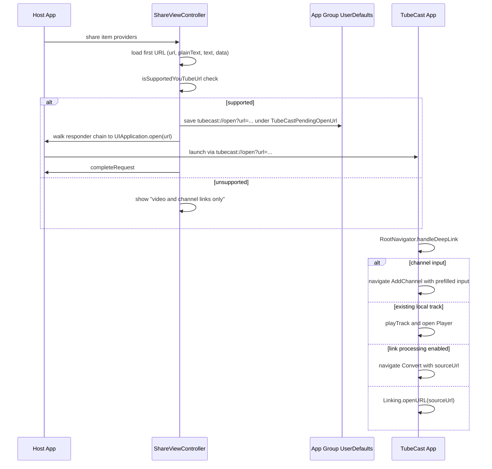

# Subscriptions & Feed

TubeCast lets users follow YouTube channels and browse their new uploads as a feed, convert any feed item into an audio job, preview a publisher's channel from a playing track, and see public discovery content on the Home screen. Two entry points feed this system: in-app navigation (`AddChannel`, `Feed`, `Home`) and the iOS share extension, which forwards YouTube links to the app via a `tubecast://open?url=...` deep link.

## Components

| Area | Files | Role |
|---|---|---|
| Channel storage | `src/features/youtubeFeed/storage.ts` | AsyncStorage-backed subscription list under key `youtube_subscriptions`, with legacy-shape migration |
| Feed API | `src/features/youtubeFeed/api.ts` | `resolveFeedSource` (POST `/api/feed/resolve-source`) and `fetchFeedItems` (POST `/api/feed/recent-items`) via the shared `apiClient` |
| Feed cache | `src/features/youtubeFeed/cache.ts` | AsyncStorage cache under `youtube_feed_query_cache_v1`, 24h TTL, keyed by subscribed-channel set |
| Input validation | `src/features/youtubeFeed/input.ts` | Pure predicates for supported YouTube video URLs and channel inputs (URL, `UC...` id, `@handle`) |
| Status merge | `src/features/youtubeFeed/feed.ts` | Dedup/sort of feed items and mapping of job status onto items (`matchJobStatus`, `markItem*`) |
| Submitted jobs | `src/features/youtubeFeed/submittedJobsStorage.ts` | AsyncStorage map `feed_submitted_jobs` of in-flight conversions per `platformItemId`, 24h TTL with self-cleaning |
| React Query hooks | `src/features/youtubeFeed/hooks.ts` | `useSubscribedChannels`, `useFeedVideos`, `useAddChannel`, `useRemoveChannel`, `useSubscribeChannel`, `useChannelSubscription`; screenshot demo mode short-circuits all of them |
| Discover | `src/features/discover/` | `/api/discover` GET with no-cache headers, 24h AsyncStorage cache, 5-min in-memory `staleTime` |
| Screens | `src/screens/FeedScreen.tsx`, `AddChannelScreen.tsx`, `ManageChannelsScreen.tsx`, `PublisherPreviewSheet.tsx`, `HomeScreen.tsx` | UI over the above |
| Share extension | `ios-share-extension/ShareViewController.swift` | iOS entry point converting a shared link into a TubeCast deep link |

## Subscribing to channels

`AddChannelScreen` accepts free-form input (channel URL, `UC...` id, or `@handle`) prefilled from the route param. On resolve it first checks `isSupportedYouTubeVideoUrl`; a video link is not subscribable — it offers to route to the `Convert` screen instead (gated by the `linkProcessingEnabled` remote-config flag). Otherwise `useAddChannel` runs `resolveFeedSource(input)` against `/api/feed/resolve-source`, stamps `addedAt`, and persists via `addChannel`. `addChannel` throws `"already subscribed to this channel"` on a duplicate `(platform, platformSourceId)` pair; both add and remove mutations invalidate the `youtubeSubscriptions` and `youtubeFeed` React Query keys, which is what makes the feed refetch after a subscription change.

`storage.ts` migrates a legacy `{id, title, thumbnailUrl, addedAt}` shape into the current `FeedSource` (inferring `https://www.youtube.com/channel/<id>`) on every read, and filters out entries with no `platformSourceId`.

## Feed browsing and caching

`useFeedVideos` (`hooks.ts`) owns the `["youtubeFeed"]` query:

1. **Restore**: on cold mount (no query data yet), it reads `getCachedYoutubeFeed(channels)` from AsyncStorage and seeds the query cache with the stored `savedAtMs` as `updatedAt` before enabling the network query. This shows last session's feed immediately.
2. **Fetch**: `queryFn` reads the subscribed channels; with zero channels it clears the persisted cache to `[]` and returns empty. Otherwise it calls `fetchFeedItems(channels, signal)`, truncates to 100 items, marks all items `status: "new"` (job matching in the main feed is deliberately deferred — "v1"), and fire-and-forget `saveCachedYoutubeFeed`.
3. `staleTime: 0` means every mount refetches; the persisted cache only bridges cold starts.

**Cache invalidation** (`youtubeFeed/cache.ts`): the stored payload includes a `sourceKey` — the sorted `platform:platformSourceId` list of subscribed channels. On read, `parseStoredCache` rejects the cache if the current channel set differs, any item fails the `isFeedItemWithStatus` shape guard, the JSON is corrupt, or `savedAt` is older than `YOUTUBE_FEED_CACHE_MAX_AGE_MS` (24 hours). So adding/removing a channel or any schema drift silently invalidates the feed cache; a null result just falls through to the network fetch.

`FeedScreen` layers on top: a channel picker modal filters `videos` by `platformSourceId` (auto-clears the filter if the channel is unsubscribed), and `submittedJobs` state overlays per-item conversion state.

## Feed items → conversion jobs

`FeedScreen.handleConvert` is the bridge into the conversion pipeline (see `/openwiki/features/conversion-pipeline.md`): it calls `useSubmitJob().mutateAsync(video.sourceUrl)`, then records `{jobId, sourceUrl, submittedAt}` in `submittedJobsStorage` keyed by the item's `platformItemId`. `submittedJobsStorage` is a 24-hour-TTL AsyncStorage map; `getSubmittedFeedJobs` re-validates every entry on read and rewrites storage when malformed or expired entries are pruned, so stale "converting" badges disappear after a day or on corruption. `FeedScreen.handleTerminal` removes an entry when the job reaches a terminal state.

`feed.ts` computes the display status: `matchJobStatus` maps a job lookup (`ready` → item `ready` with `jobId`, `queued`/`processing` → `converting`, anything else back to `new`/retryable), and `markItemConverting/Ready/New` update a single item in the local array.

### Publisher preview

`PublisherPreviewSheet` (routed with `channelId`/`channelName` taken from a playing job) shows a channel the user is *not* necessarily subscribed to. It:

- builds a `FeedSource` locally and subscribes/unsubscribes via `useSubscribeChannel` / `useRemoveChannel` (no `resolve-source` round trip — the identity is already known),
- checks subscription state offline with `useChannelSubscription` → `isChannelSubscribed`,
- lazily loads (never prefetches) `fetchFeedItems([displaySource])` and merges local state via a `JobLookup` built from local playlist tracks (video id parsed from each track's `sourceUrl` → `ready`) plus `getSubmittedFeedJobs` (→ `converting`),
- polls `getJob` every 3 seconds for converting items; on `ready` it converts the job to a track with `trackFromReadyJob` and adds it to the playlist (`markItemReady`), on `failed`/`expired` it resets to retryable (`markItemNew`), and live-stream jobs are pinned as permanently unsupported.

## Discover / Home

`HomeScreen` renders `useDiscover()`: GET `/api/discover` with `Cache-Control: no-cache` headers, returning `{recent, popular}` of `DiscoverItem` (`jobId`, `title`, `thumbnailUrl`, `durationSeconds`, `sourceId`, `convertCount` — deliberately **no** `sourceUrl`, to avoid leaking original submission URLs in a public list). The discover cache (`discover_query_cache_v1`, 24h TTL, shape-validated) restores cold starts; the query itself uses a 5-minute `staleTime`. Tapping a card does a live `getJob(jobId)` lookup: a non-expired ready job plays immediately (note `audioExpiresAt` is a UTC SQLite datetime and must be parsed as UTC); otherwise it reconstructs `https://www.youtube.com/watch?v=${sourceId}` and navigates to `Convert` — or falls back to opening YouTube when `linkProcessingEnabled` is off.

## iOS share extension

`ShareViewController.swift` is the system share-sheet entry point:

The extension validates the same link shapes as the app: `youtu.be/<11-char-id>`, `youtube.com/watch?v=`, `/embed/` and `/shorts/` video paths, `/channel/UC...` and `/@handle` channel paths, over https only. It percent-encodes the source URL into `tubecast://open?url=...`, mirrors it into the `group.com.tomyail.tubecast` app-group UserDefaults under `TubeCastPendingOpenUrl` (a fallback if the launch fails), and launches the container app by walking the responder chain to the host's `UIApplication` and calling the non-deprecated `open(_:options:completionHandler:)` — `extensionContext.open(_:)` and the legacy `openURL:` selector do not work from extensions on modern iOS. This must happen before `completeRequest`, while the extension is still alive.

Inside the app, `RootNavigator.handleDeepLink` (wired to both `Linking.getInitialURL()` and runtime `url` events, only after the navigation container is ready) parses the link with `parseTubeCastOpenUrl` from `src/features/shareLinks/links.ts`. Channel inputs go to `AddChannel` prefilled; URLs matching an existing local track (`findTrackForSourceUrl`) play immediately; otherwise they go to `Convert` when link processing is enabled, or fall back to opening YouTube. `tubecast://listen?url=...&t=...` links (in-app shares) take the same path with a start timestamp.

## Failure and lifecycle notes

- All AsyncStorage caches are defensively validated (`isFeedItemWithStatus`, `isDiscoverResponse`, submitted-job entry checks); any mismatch or parse error yields `null`/`{}` rather than a crash.
- Cache writes are fire-and-forget with `console.warn` on failure — persistence is best-effort and never blocks the query.
- `useFeedVideos`/`useDiscover` cancel restore effects on unmount and only seed the query cache if it is still empty, so a fast network response is never overwritten by stale disk data.
- Duplicate-subscription attempts throw from `addChannel` and surface as a generic error in `AddChannelScreen`.
- `screenshotDemoMode` replaces every hook with static demo data, keeping screenshots network-free.

## Tests

Focused unit coverage lives in `test/youtubeFeed/`: `cache.test.ts` (TTL expiry, channel-set mismatch, shape validation), `storage.test.ts` (legacy migration, duplicate-subscription error, remove), `feed.test.ts` (dedup/sort/limit, status mapping, mark helpers), `input.test.ts` (URL/handle predicates), `submittedJobsStorage.test.ts` (TTL pruning and rewrite-on-dirty), and `api.test.ts` (resolve/recent-items request shapes). Discover tests live in `test/discover/`.
