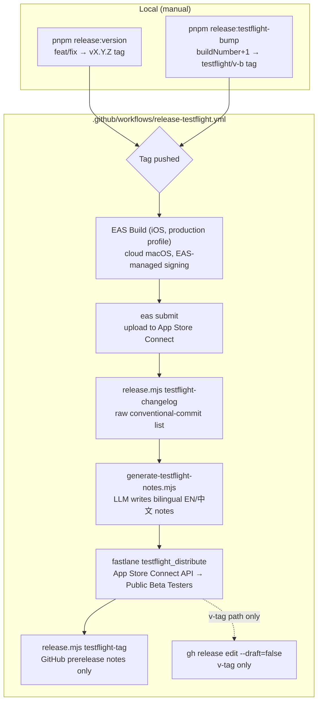

# Release Operations

This document covers TubeCast release workflows, including the CI-driven TestFlight pipeline, App Store metadata, and version management.

## Prerequisites

### Tools

- **EAS CLI** - Cloud iOS builds (`eas build`) and TestFlight upload (`eas submit`) used by CI
- **fastlane** - Ruby gem for iOS automation: `testflight_distribute` lane and store metadata (managed via `mise` and `Gemfile`)
- **mise** - Task runner and version manager (`.mise.toml`)
- **Expo CLI** - For prebuild and native project generation
- **Xcode** - For local iOS builds and archives (manual fallback)

### Environment Variables

Required for TestFlight uploads:

```bash
# App Store Connect API Key (recommended)
APP_STORE_CONNECT_API_KEY_KEY_ID=<key_id>
APP_STORE_CONNECT_API_KEY_ISSUER_ID=<issuer_id>
APP_STORE_CONNECT_API_KEY_KEY_FILEPATH=/path/to/AuthKey_<key_id>.p8

# TestFlight distribution
TESTFLIGHT_GROUPS="Public Beta Testers"
TESTFLIGHT_CHANGELOG="What's new in this build"

# Optional IPA paths
IPA_PATH=/path/to/TubeCast.ipa
IPA_OUTPUT_DIR=build/ios
```

Source: `/fastlane/Fastfile`

## Release Script (`/scripts/release.mjs`)

The release script orchestrates version bumps, changelog generation, and TestFlight distribution.

### Architecture

The script handles three release phases:

- **Phase A** - Version bump, changelog generation, git tagging
- **Phase B** - Native project prebuild and Xcode archive (manual)
- **Phase C** - Draft release publication and repository sync

### Available Commands

```bash
# Bump buildNumber, generate changelog, create tag
pnpm release:version

# Generate expo prebuild (writes buildNumber to native)
pnpm release:archive

# Publish draft release to GitHub
pnpm release:publish

# Hotfix: bump buildNumber only (no marketing version bump)
pnpm release:rebuild

# Sync iOS native project version from app.json
pnpm release:sync-ios

# Generate changelog for TestFlight
pnpm release:changelog

# --- TestFlight workflow ---

# Bump buildNumber, commit, tag and push testflight/<version>-<build> (triggers CI)
pnpm release:testflight-bump

# Prebuild and sync Xcode version (local fastlane fallback path)
pnpm release:testflight-prepare

# Build IPA with fastlane (local fastlane fallback path)
pnpm release:testflight-build

# Upload IPA to TestFlight via fastlane (local fastlane fallback path, no distribution)
pnpm release:testflight-upload

# Generate raw changelog from commits (used by CI and locally)
pnpm release:testflight-changelog

# Generate bilingual LLM "What to Test" notes (.testflight-whats-new)
pnpm release:notes:generate

# Distribute already-uploaded build to tester groups (local fastlane fallback path)
pnpm release:testflight-distribute

# Tag and fill GitHub prerelease notes (skips tag creation if it already exists)
pnpm release:testflight-tag

# Full TestFlight flow (bump + build + upload + distribute)
pnpm release:testflight
```

Source: `/scripts/release.mjs`

## TestFlight Workflow

TestFlight distribution is **CI-driven**. The only manual step is cutting the version locally; building the IPA, uploading to App Store Connect, generating "What to Test" notes, and distributing to testers all happen automatically in `.github/workflows/release-testflight.yml`.

The pipeline uses a **tag-first** trigger design: the local command creates and pushes the trigger tag *before* any build runs. The workflow listens for two tag patterns and never creates a tag matching either pattern itself (this avoids a self-retrigger loop), so `testflight-tag` only ever fills in GitHub release notes when the tag already exists.



### Release paths

| Tag pushed | Triggered by | Steps run | Notes |
|---|---|---|---|
| `v*.*.*` | `pnpm release:version` | build → submit → changelog → LLM notes → distribute → **promote draft Release** | Marketing version release. Draft GitHub Release is flipped to published. |
| `testflight/*` | `pnpm release:testflight-bump` | build → submit → changelog → LLM notes → distribute → tag (notes only) | Same-version hotfix. buildNumber+1, no marketing version bump. No Release promotion. |
| — | `workflow_dispatch` (GitHub UI / `gh workflow run`) | same as `testflight/*` | Manual fallback for re-running without pushing a new tag. |

### Same-version hotfix rebuild

```bash
pnpm release:testflight-bump
```

This now does three things:
1. Increments `ios.buildNumber` in `app.json` and commits the change.
2. Creates the `testflight/<version>-<build>` tag locally (skipped if it already exists).
3. Pushes the tag, which **auto-triggers** the workflow.

No manual `workflow_dispatch` click is needed. CI runs the same build/upload/distribute steps as a version release, then calls `release:testflight-tag` — which detects the tag already exists and only fills in the GitHub prerelease notes (it never pushes a new tag).

### Why EAS Submit, not fastlane upload

CI uploads the IPA via `eas submit`, not fastlane's `upload_to_testflight` (pilot). Pilot shells out to Apple's Transporter tool, which has long-standing unresolved bugs on Linux runners ([fastlane/fastlane#16996](https://github.com/fastlane/fastlane/issues/16996)) and crashed on the `ubuntu-latest` runner. `eas submit` uploads through EAS's own infrastructure and is unaffected.

The fastlane `testflight_distribute` step is kept, because it is a pure App Store Connect API call (no binary transport) and is therefore Linux-safe.

### LLM-generated "What to Test" notes

`scripts/generate-testflight-notes.mjs` reads `.testflight-changelog.md` (the raw conventional-commit list produced by `release.mjs testflight-changelog`) and calls an LLM (Anthropic-compatible API, configured to `glm-5.2` via `RELEASE_NOTES_MODEL_ID` and `ANTHROPIC_BASE_URL`) to rewrite it into a bilingual EN/中文 "What to Test" summary. The output is written to `.testflight-whats-new`, which is the fallback file the `testflight_distribute` fastlane lane reads when `TESTFLIGHT_CHANGELOG` is unset.

Locally you can preview the output without writing the file:

```bash
pnpm release:notes:generate -- --dry-run
```

### CI prerequisites (one-time)

Before the workflow can run end-to-end:

- **EAS Build** — `eas login` / `eas init` writes `expo.extra.eas.projectId` into `app.json`; `eas credentials` for iOS → Build Credentials lets EAS manage the Apple signing certificate/provisioning profile (no `fastlane match` needed). The `expo.extra.eas.build.experimental.ios.appExtensions` entry in `app.json` is required so `eas credentials` also provisions the `TubeCastShareExtension` target (EAS does not discover hand-added extension targets on its own).
- **EAS Submit** — `eas credentials` for iOS → App Store Connect: Manage your API Key, stored server-side by EAS (not a GitHub secret).
- **GitHub secrets** — `EXPO_TOKEN` (Expo service-account token), `APP_STORE_CONNECT_API_KEY_KEY_ID` / `APP_STORE_CONNECT_API_KEY_ISSUER_ID` / `APP_STORE_CONNECT_API_KEY_P8` (used only by the fastlane distribute step), and `ANTHROPIC_API_KEY` (reused from the OpenWiki workflow).
- **`eas.json`** — `submit.production.ios.ascAppId` (the app's numeric App Store Connect ID) is required by `eas submit`.

Source: `.github/workflows/release-testflight.yml`, `eas.json`, `scripts/generate-testflight-notes.mjs`

### Local fastlane fallback

If EAS is unavailable, the original local fastlane path still works as a manual fallback. `release:testflight-prepare`, `release:testflight-build`, `release:testflight-upload`, `release:testflight-distribute`, and `release:testflight-tag` together reproduce the build → upload → distribute → tag sequence locally:

```bash
pnpm release:testflight         # full local fastlane flow
```

Source: `/scripts/release.mjs`

## Fastlane Actions

### Build

```bash
fastlane ios testflight_build
```

Builds an App Store IPA without uploading.

**Output:** `build/ios/TubeCast.ipa`

### Upload (CI)

```bash
eas submit --platform ios --id <buildId> --non-interactive --wait
```

Uploads the EAS-built IPA to App Store Connect via EAS's own infrastructure. Used by CI instead of fastlane's `upload_to_testflight` (Transporter is broken on Linux — see [TestFlight Workflow](#why-eas-submit-not-fastlane-upload)).

### Distribute

```bash
fastlane ios testflight_distribute
```

Distributes an uploaded build to tester groups with changelog.

### Metadata

```bash
pnpm store:metadata
```

Uploads App Store metadata (descriptions, keywords, promotional text) for all locales.

**Locales:**
- en-US (English)
- zh-Hans (Simplified Chinese)
- zh-Hant (Traditional Chinese)

### Screenshots

```bash
pnpm store:screenshots
```

Uploads App Store screenshots for all locales.

**Screenshots are organized by device and locale:**
```
fastlane/screenshots/
├── en-US/
│   ├── 0_APP_IPHONE_65_0.png
│   ├── 0_APP_IPAD_PRO_3GEN_129_0.png
│   └── ...
├── zh-Hans/
│   └── ...
└── zh-Hant/
    └── ...
```

### Store Assets (Metadata + Screenshots)

```bash
pnpm store:assets
```

Uploads both metadata and screenshots in one command.

### Download Metadata/Screenshots

```bash
pnpm store:download-metadata
pnpm store:download-screenshots
```

Downloads current App Store metadata and screenshots to `fastlane/` for local inspection.

Source: `/fastlane/README.md`

## Version Management

### Version Components

- **Marketing version** (`app.json` → `expo.version`) - User-facing version (e.g., 1.2.0)
- **Build number** (`app.json` → `expo.ios.buildNumber`) - Integer for App Store (e.g., 11)

### Version Bumps

Marketing version bumps follow Conventional Commits via `commit-and-tag-version`:

- **feat** → minor version bump (1.0.0 → 1.1.0)
- **fix** → patch version bump (1.0.0 → 1.0.1)
- **feat! /BREAKING CHANGE** → major version bump (1.0.0 → 2.0.0)

Build numbers are incremented manually for TestFlight releases:

```bash
# Edit app.json → increment ios.buildNumber
pnpm release:testflight-bump
```

Source: `/scripts/release.mjs`

## Screenshot Demo Mode

When preparing App Store screenshots, use screenshot demo mode to avoid exposing real user data.

### Enable Demo Mode

```bash
export EXPO_PUBLIC_SCREENSHOT_DEMO_MODE=1
# Optional: render the in-app demo UI in Simplified Chinese instead of English
export EXPO_PUBLIC_SCREENSHOT_DEMO_LANGUAGE=zh-CN
```

In demo mode the app language is forced to `en` unless `EXPO_PUBLIC_SCREENSHOT_DEMO_LANGUAGE=zh-CN` is set (`src/i18n/index.tsx`). This drives only the in-app UI capture language, not the marketing copy overlaid by the screenshot generator.

### Run with Demo Mode

```bash
# Development server with demo mode
pnpm start:screenshots

# iOS simulator (iPhone 13 Pro Max)
pnpm ios:screenshots:release

# iPad simulator (13-inch iPad Pro)
pnpm ios:screenshots:ipad
```

### Demo Mode Behavior

- Replaces all network/storage data with fixed demo content
- Uses URL-referenced cover images (not bundled into IPA)
- Provides consistent, review-safe content for screenshots
- Only active when `EXPO_PUBLIC_SCREENSHOT_DEMO_MODE=1`

### Demo Assets Location

Demo covers are stored in `/screenshot-assets/demo-covers/` and referenced by URL:

```
https://raw.githubusercontent.com/Tomyail/tubecast/main/mobile/screenshot-assets/demo-covers
```

**⚠️ Important:** Do not move demo covers into `assets/`. Files in `assets/` are bundled into the IPA by Metro. Demo mode must use URL references to avoid bloating production builds.

Source: `/screenshot-assets/README.md`, `/src/features/demoMode/config.ts`

### Store Screenshot Generation

App Store screenshots are composed into five-slide marketing stories for three locales (en-US, zh-Hans, zh-Hant), each slide pairing a localized headline with a single-line supporting message over a framed in-app UI capture. Slide five is a Lock Screen playback composition demonstrating background audio controls. The full set is 30 assets (five slides × three locales × iPhone/iPad).

```bash
swift scripts/generate-store-screenshots.swift
```

Run from the mobile directory. The generator reads the unframed UI captures in `screenshot-assets/store-ui/` and overlays localized marketing copy; keep those source captures unchanged so repeated runs do not nest an already-framed screenshot. Traditional Chinese intentionally reuses the English UI captures beneath localized copy until native `zh-Hant` simulator captures exist. fastlane infers the App Store screenshot slot from each output image's resolution; upload with `bundle exec fastlane ios screenshots_push`.

The demo-mode-only conversion proof rendered in `ConvertScreen.tsx` (`ScreenshotConversionProof`, gated on `screenshotDemoMode && url.trim()`) supplies the in-app UI for these compositions and uses the `home.linkAdded`, `home.audioReady`, `home.demoAudioTitle`, and `home.demoAudioMeta` translation keys.

Source: `scripts/generate-store-screenshots.swift`, `fastlane/screenshots/README.md`, `src/screens/ConvertScreen.tsx`

## Conventional Commits

This project uses Conventional Commits with automated version bumping and commit type guards.

See `/openwiki/development/conventions.md` for commit message rules and the `/AGENTS.md` file for AI agent guidelines.

## Checklist: Before Releasing

- [ ] Verify `app.json` version and buildNumber are correct
- [ ] Ensure no bundled demo assets in `assets/demo-covers/`
- [ ] Run tests: `pnpm test`
- [ ] Test on physical device (TestFlight or local build)
- [ ] Update `.testflight-changelog.md` or set `TESTFLIGHT_CHANGELOG`
- [ ] Verify App Store metadata translations are current
- [ ] Confirm App Store Connect API key is configured
- [ ] Tag release with semantic version

## Troubleshooting

### Build Fails

- Ensure Xcode command line tools are installed: `xcode-select --install`
- Verify development team is set in Xcode project
- Check `ExportOptions.plist` is correct for app-store exports

### Upload Fails

- Verify App Store Connect API key environment variables are set
- Check IPA exists at `build/ios/TubeCast.ipa`
- Ensure buildNumber matches uploaded build

### Demo Mode Not Working

- Confirm `EXPO_PUBLIC_SCREENSHOT_DEMO_MODE=1` is set
- Check Metro bundler was restarted after setting env var
- Verify demo assets are accessible at the URL

### Version Bump Issues

- Check commits follow Conventional Commits format
- Verify `package.json` version is synced with `app.json`
- Run `pnpm release:version` to trigger version bump manually

## References

- **Release script:** `/scripts/release.mjs`
- **Fastlane config:** `/fastlane/Fastfile`
- **App metadata:** `/fastlane/metadata/`
- **Export options:** `/fastlane/ExportOptions.plist`
- **Commit conventions:** `/AGENTS.md`
- **Conventional Commits:** See `/openwiki/development/conventions.md`
